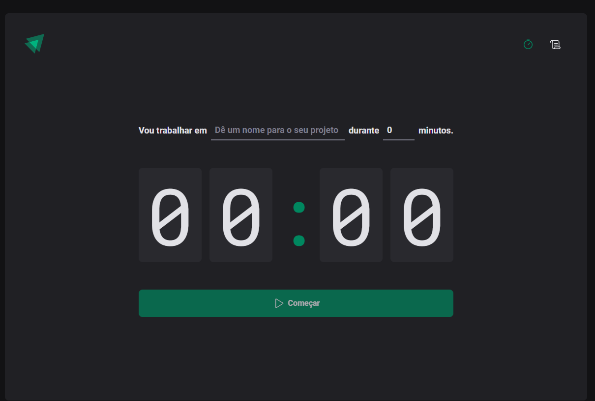
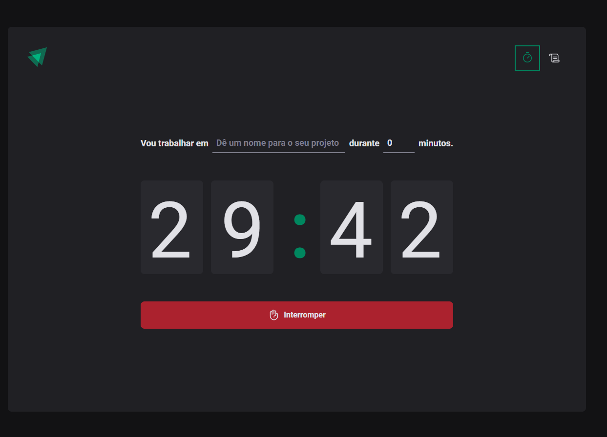
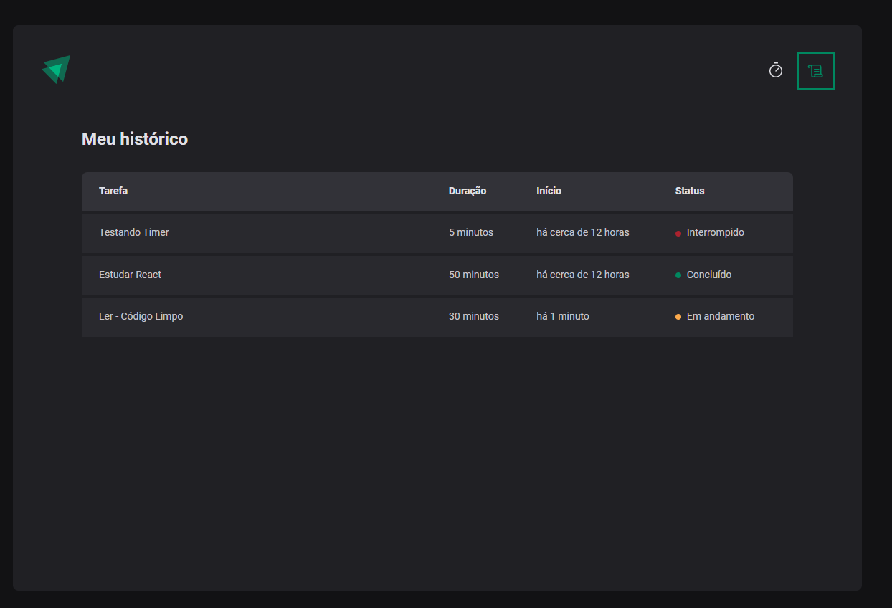

# Timer (Pomodoro) (React)

Essa aplicação foi desenvolvida durante a trilha de formação React da Rocketseat. Utiliza das melhores práticas do React como useContext e useReducers.

## Executando

Após clonar o repositório, acesse a pasta do projeto e execute os comandos abaixo:

```sh
npm install
npm run dev
```

Acesse <http://localhost:5173> para visualizar a aplicação.

## Imagens

<h2 align="center">nterromper Ciclo</h2>
<p align="center">
  
</p>

<h2 align="center">Histórico</h2>
<p align="center">
  
</p>

## 🚀 Tecnologias

Esse projeto foi desenvolvido com as seguintes tecnologias:

- **React**
- **Context API**
- **Reducers**
- **TypeScript**
- **Styled Components**
- **react-router-dom**
- **zod**
- **immer**
- **date-fns**